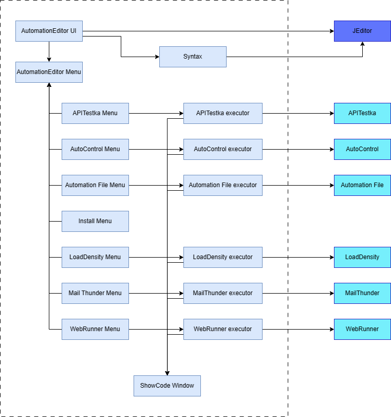

[AutomationIDE Doc Click Here!](https://automationeditor.readthedocs.io/en/latest/)

[Using this IDE edit tkinter video](https://www.youtube.com/watch?v=VXm8L2qrdSU&ab_channel=JEChen)

---

## Notice
> * If you can't run program and get argument or internal error on windows, Please update your powershell.
> * https://github.com/PowerShell/PowerShell/releases

---
## What is Automation Editor
> Project Kanban \
> https://github.com/orgs/Integration-Automation/projects/2/views/1 \
> * Native support AutoControl script.
> * Native support APITestka script.
> * Native support Load Density script.
> * Native support WEB Runner script.
> * Native support Mail Thunder script.
> * Native support File Automation script.
> * Native support Front Engine script.
> * Automation instance monitor.
> * Automation project support.
> * Docs support.
> * BingGPT (requires setting up cookies, tutorial available in the IDE) 
> * DALL-E3 Bing version for image generation (requires setting up another type of cookie, tutorial available in the IDE)
> * Auto-save (available after the first save or after opening a file), auto-complete, jump to definition. 
> * Bilingual interface (English, Traditional Chinese) Choose font and size. 
> * Tabbed browsing, split window functionality. 
> * Embedded browser. 
> * Embedded Jupyter and IPython. 
> * Built-in automation packages.
> * Multiple UI style choices. 
> * Python venv and management to choose the Python interpreter to use.
> * Code style checking and auto-formatting (PEP8). 
> * Debugger.
> * Multiple Shell command executors (run multiple Shells at once). 
> * Multiple program executors (run multiple programs at once). Custom colors.

---

### install
> pip install automation_editor

