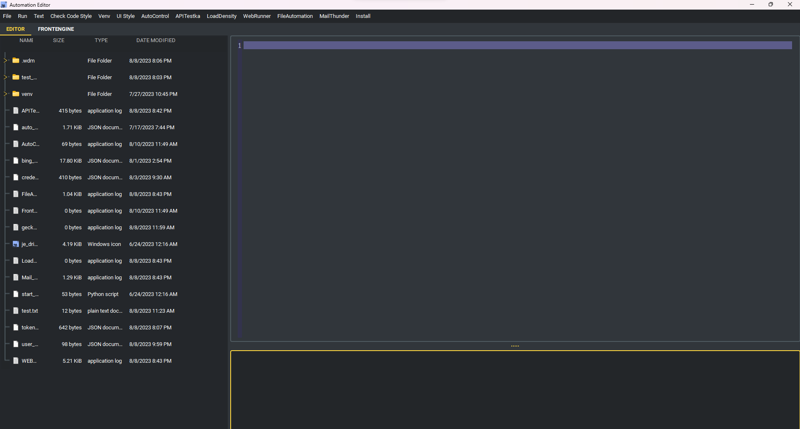

怎麼擴充 Automation Editor UI
----

.. code-block::

    from PySide6.QtWidgets import QWidget, QGridLayout, QLineEdit, QPushButton, QLabel

    from automation_editor import start_editor, EDITOR_EXTEND_TAB

    # You can use you own QWidget
    class TestUI(QWidget):

        def __init__(self):
            super().__init__()
            self.grid_layout = QGridLayout(self)
            self.grid_layout.setContentsMargins(0, 0, 0, 0)
            self.grid_layout.setContentsMargins(0, 0, 0, 0)
            self.label = QLabel("")
            self.line_edit = QLineEdit()
            self.submit_button = QPushButton("Submit")
            self.submit_button.clicked.connect(self.show_input_text)
            self.grid_layout.addWidget(self.label, 0, 0)
            self.grid_layout.addWidget(self.line_edit, 1, 0)
            self.grid_layout.addWidget(self.submit_button, 2, 0)

        def show_input_text(self):
            self.label.setText(self.line_edit.text())

    EDITOR_EXTEND_TAB.update({"test": TestUI})

    start_editor(debug_mode=True)
