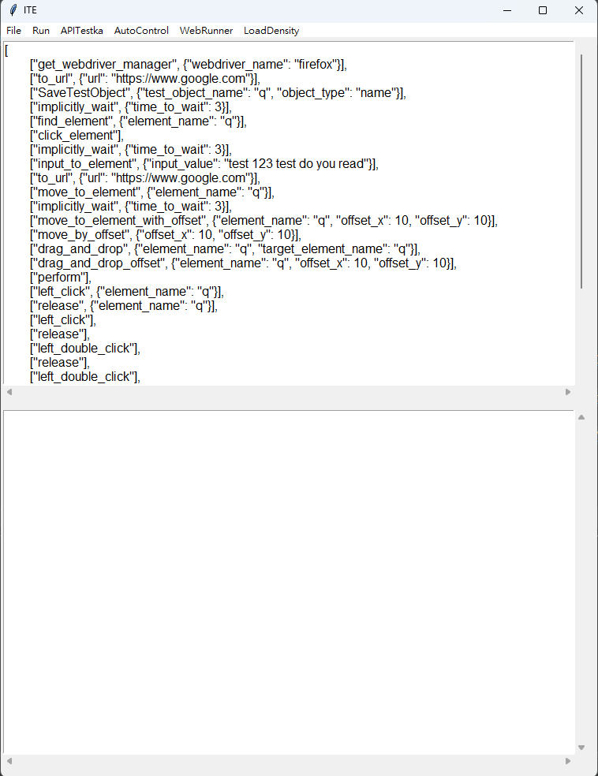

====================================
ITE UI Example
====================================

.. code-block::

    Under the menu area is code edit area
    Under code edit area is result check area

* File Menu
    * Save File
    * Open File
    * Editor Setting
        * Text
            * Font
            * Font Size
        * Encoding
        * Language
            * python
            * python3
            * java
* Run Menu
    * Run Program
    * Run on shell
    * Stop Program
    * Clean Result
* APITestka Menu
    * Execute APITestka script
    * Execute and send mail
    * Execute multi script
    * Execute multi script with send
* AutoControl Menu
    * Execute WebRunner script
    * Execute and send mail
    * Execute multi script
    * Execute multi script with send
* WebRunner Menu
    * Execute WebRunner script
    * Execute and send mail
    * Execute multi script
    * Execute multi script with send
* LoadDensity Menu
    * Execute LoadDensity script
    * Execute and send mail
    * Execute multi script
    * Execute multi script with send

.. code-block::

    File Menu include basic editor setting and file manager
    * editor setting include font and font size, encoding, language
    * save file: open a dialog ask user what location they want to save current file
    * open file: open a dialog ask user what file they want to load
    * font: show all font on the computer and user can choose one to use
    * font size: show size between 12 to 34 user can choose one size to resize font
    * encoding: choose one encoding on list to change file encoding
    * language: user can choose what language they want to use

    Run Menu include run program option
    * run program: run code edit area text use choose language
    * run on shell: run code edit area text on shell
    * stop program: terminate current running program
    * clean result: clear result area text

    APITestka Menu
    * Execute APITestka script
    * Execute and send mail
    * Execute multi script
    * Execute multi script with send

    AutoControl Menu
    * Execute WebRunner script
    * Execute and send mail
    * Execute multi script
    * Execute multi script with send

    WebRunner Menu
    * Execute WebRunner script
    * Execute and send mail
    * Execute multi script
    * Execute multi script with send

    LoadDensity Menu
    * Execute LoadDensity script
    * Execute and send mail
    * Execute multi script
    * Execute multi script with send